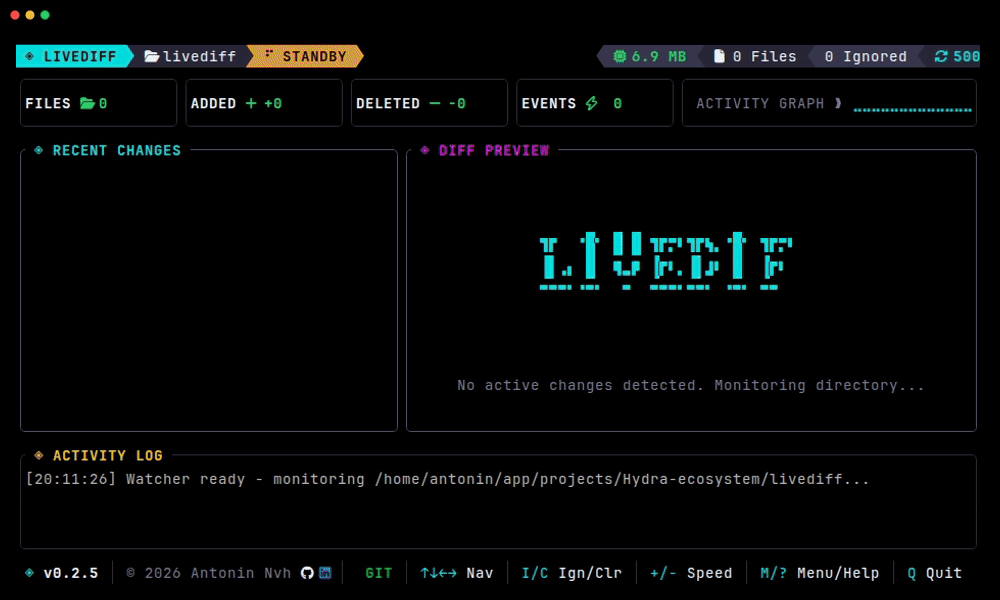

# Livediff 👁️

**Live terminal diffs while files change.** Livediff is a lightweight Rust TUI companion to `git diff` for generators, refactors, migrations, formatters, and config edits.

<p align="center">
  
</p>

[](https://github.com/SoCkEt7/Livediff/actions)
[](https://crates.io/crates/livediff)
[](https://github.com/SoCkEt7/Livediff/blob/main/LICENSE-MIT)

## Why Livediff?

`git diff` is great after the fact. Livediff shows what changes **while another tool is still editing files**.

Use it when you want immediate feedback during:

- code generators and template systems;
- formatters, migrations, and codemods;
- refactors that touch many files;
- documentation or config generation;
- terminal-first workflows where a GUI diff app is too heavy.

Livediff does not replace Git. It complements `git diff` by turning file changes into a live terminal view.

## Quick start

```bash
cargo install livediff
livediff .
```

Monitor a specific path or ignore noisy files:

```bash
livediff ./src
livediff . --ignore "target/" --ignore "*.tmp"
```

## Interactive web showcase

Try the zero-install browser demo: **[socket7.github.io/Livediff](https://socket7.github.io/Livediff/)**

It simulates the TUI, file changes, and real-time diff animations before you install anything.

## Features

- **Real-time monitoring** — native OS filesystem events via `notify`.
- **Interactive TUI** — terminal interface built with `ratatui` and `crossterm`.
- **Character-level diffs** — precise added/removed highlights using `similar`.
- **Low idle footprint** — event-driven redraws; no Electron or Node runtime.
- **Smart filtering** — respects `.gitignore` and accepts custom glob ignores.
- **Zero-install preview** — hosted interactive demo for quick evaluation.

## How is it different?

| Tool | Best for | Livediff difference |
| --- | --- | --- |
| `git diff` | Reviewing changes after edits | Watches changes live as they happen |
| `watch` + `diff` | Simple repeated shell checks | Gives an interactive TUI and file list |
| GUI diff tools | Manual visual review | Stays lightweight and terminal-native |
| file watcher logs | Knowing something changed | Shows exactly what changed |

## Example workflows

See [docs/use-cases.md](docs/use-cases.md) for practical workflows:

- watching generated files;
- inspecting migration output;
- monitoring formatter/codemod changes;
- reviewing docs/config generation.

## Installation

### Via Cargo

```bash
cargo install livediff
```

### Pre-built binaries

Tagged releases provide Linux, macOS, and Windows archives when available:

[github.com/SoCkEt7/Livediff/releases](https://github.com/SoCkEt7/Livediff/releases)

## CLI options

```text
Usage: livediff [OPTIONS] [PATH]

Arguments:
  [PATH]  The path to monitor [default: .]

Options:
  -i, --ignore <IGNORE>   Ignore files matching this glob pattern (can be used multiple times)
      --show-hidden       Show hidden files
      --no-ignore         Do not respect ignore files (.gitignore, .ignore, etc.)
      --no-ignore-parent  Do not respect ignore files in parent directories
      --no-ignore-vcs     Do not respect git/VCS ignore files (.gitignore, etc.)
  -h, --help              Print help
  -V, --version           Print version
```

## Roadmap

- More packaged install options, including Homebrew.
- Short terminal recording with asciinema.
- More workflow recipes for generators, migrations, and monorepos.
- Community-requested filters and export options.

## Contributing

Contributions are welcome. Start with [CONTRIBUTING.md](CONTRIBUTING.md), or open an issue with the workflow you want Livediff to support better.

## License

Licensed under either [MIT](LICENSE-MIT) or [Apache-2.0](LICENSE-APACHE), at your option.
