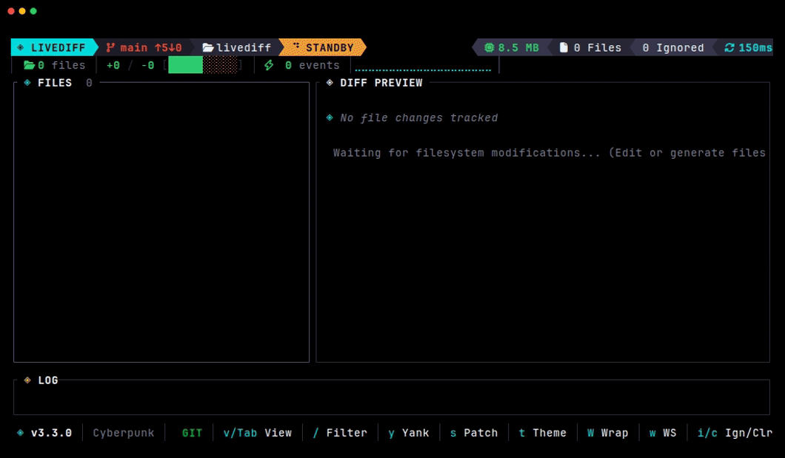

# Livediff 👁️

**Live terminal diffs while files change.** Livediff is a lightweight Rust TUI companion to `git diff` for generators, refactors, migrations, formatters, and config edits.

<p align="center">

</p>

[](https://github.com/SoCkEt7/Livediff/actions)
[](https://crates.io/crates/livediff)
[](https://github.com/SoCkEt7/Livediff/blob/main/LICENSE-MIT)
[](https://github.com/sponsors/SoCkEt7)
[](https://www.buymeacoffee.com/antoninnvh)
[](https://github.com/SoCkEt7)
[](https://github.com/SoCkEt7)


## Why Livediff?

`git diff` is great after the fact. Livediff shows what changes **while another tool is still editing files**.

Use it when you want immediate feedback during:

- code generators and template systems;
- formatters, migrations, and codemods;
- refactors that touch many files;
- documentation or config generation;
- terminal-first workflows where a GUI diff app is too heavy.

Livediff does not replace Git. It complements `git diff` by turning file changes into a live terminal view.

## Quick start

### Homebrew (macOS & Linux)
```bash
brew install socket7/tap/livediff
livediff .
```

### Cargo (crates.io)
```bash
cargo install livediff
livediff .
```

Monitor a specific path or ignore noisy files:

```bash
livediff ./src
livediff . --ignore "target/" --ignore "*.tmp"
```

## Interactive web showcase

Try the zero-install browser demo: **[socket7.github.io/Livediff](https://socket7.github.io/Livediff/)**

It simulates the TUI, file changes, and real-time diff animations before you install anything.

## Features

- **Real-time monitoring** — native OS filesystem events via `notify` with adaptive burst debouncing.
- **Dual view modes** — toggle between **Unified** and **Side-by-Side (Split)** diff views (`v` or `Tab`).
- **Interactive file filtering** — real-time substring search through modified files (`/`).
- **One-key patch export** — save instant `.patch` snapshots directly to disk (`s`).
- **Line number gutters** — synchronized original and destination line numbers (`old / new`).
- **Ignore whitespace toggle** — ignore indentation and formatting variations on the fly (`w`).
- **Character-level diffing** — precise syntax-highlighted token changes using `similar`.
- **Low idle footprint** — event-driven redraws; no Electron or Node runtime.
- **Smart ignore engine** — respects `.gitignore`, `.livediffignore`, and accepts custom glob ignore patterns.
- **Embedded code editor** — press `e` to quickly tweak files in-place without leaving your terminal.

## Keyboard Shortcuts

| Key | Action |
| --- | --- |
| `↑` / `↓` or `k` / `j` | Select file in recent modifications |
| `v` or `Tab` | Toggle **Unified** / **Side-by-Side (Split)** diff view |
| `/` | Open interactive file search / filter prompt |
| `y` | Yank / copy diff patch to system clipboard |
| `s` | Export current diff snapshot as `.patch` file |
| `t` | Cycle visual color theme (Cyberpunk, Catppuccin, Tokyo Night, Nord, Gruvbox) |
| `W` | Toggle line soft-wrapping |
| `w` | Toggle ignore whitespace in diff calculation |
| `g` / `G` | Jump to top / bottom of files list |
| `e` | Open selected file in built-in code editor |
| `←` / `→` or `h` / `l` | Scroll diff preview horizontally |
| `PgUp` / `PgDn` | Scroll diff preview vertically |
| `i` | Open ignore rules menu |
| `c` | Clear tracked changes history and logs |
| `r` | Reload `.gitignore`, `.livediffignore`, and configuration files |
| `+` / `-` | Increase / decrease UI update speed |
| `?` | Toggle help overlay |
| `q` | Quit Livediff |

## How is it different?

| Tool | Best for | Livediff difference |
| --- | --- | --- |
| `git diff` | Reviewing changes after edits | Watches changes live as they happen |
| `watch` + `diff` | Simple repeated shell checks | Gives an interactive TUI, split views & file list |
| GUI diff tools | Manual visual review | Stays lightweight, fast & terminal-native |
| file watcher logs | Knowing something changed | Shows exactly what changed in real time |

## Example workflows

See [docs/use-cases.md](docs/use-cases.md) for practical workflows:

- watching generated files;
- inspecting migration output;
- monitoring formatter/codemod changes;
- reviewing docs/config generation.

## Installation

### Via Cargo

```bash
cargo install livediff
```

### Pre-built binaries

Tagged releases provide Linux, macOS, and Windows archives when available:

[github.com/SoCkEt7/Livediff/releases](https://github.com/SoCkEt7/Livediff/releases)

## CLI options

```text
Usage: livediff [OPTIONS] [PATH]

Arguments:
  [PATH]  The path to monitor [default: .]

Options:
  -i, --ignore <IGNORE>                  Ignore files matching this glob pattern (can be used multiple times)
      --show-hidden                      Show hidden files
      --no-ignore                        Do not respect ignore files (.gitignore, .livediffignore, etc.)
      --no-ignore-parent                 Do not respect ignore files in parent directories
      --no-ignore-vcs                    Do not respect git/VCS ignore files (.gitignore, etc.)
  -s, --split                            Start in Side-by-Side (Split) diff view mode
  -w, --ignore-whitespace                Start with whitespace changes ignored in diffs
  -W, --wrap-lines                       Start with soft line-wrapping enabled
      --theme <THEME>                    Initial color theme palette [possible values: cyberpunk, catppuccin, tokyo-night, nord, gruvbox]
      --debounce-ms <DEBOUNCE_MS>        Filesystem debounce window in milliseconds [default: 25]
      --generate-completions <SHELL>     Generate shell completions for the specified shell and exit [possible values: bash, elvish, fish, powershell, zsh]
  -h, --help                             Print help
  -V, --version                          Print version
```

## Contributing

Contributions are welcome. Start with [CONTRIBUTING.md](CONTRIBUTING.md), or open an issue with the workflow you want Livediff to support better.

## ⚡ Author & Ecosystem

Livediff is built and maintained by **[Antonin Nivoche (@SoCkEt7)](https://github.com/SoCkEt7)** — Fractional CTO & Systems Architect.

- 🐙 **GitHub**: [Follow @SoCkEt7](https://github.com/SoCkEt7) for high-performance Rust tools, developer utilities, and sovereign infrastructure.
- 🛡️ **Cybersecurity & Systems**: [Nyxia.fr](https://nyxia.fr) — Security audits, penetration testing, and infrastructure engineering.
- ☕ **Support**: [Buy Me a Coffee (@antoninnvh)](https://www.buymeacoffee.com/antoninnvh) & [GitHub Sponsors](https://github.com/sponsors/SoCkEt7).
- 💼 **Advisory & Executive Mandates**: [LinkedIn](https://www.linkedin.com/in/antonin-nvh/).

## License

Licensed under either [MIT](LICENSE-MIT) or [Apache-2.0](LICENSE-APACHE), at your option.


